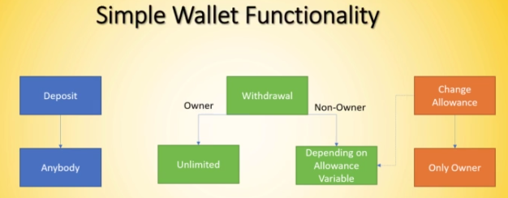

# Shared Wallet with Allowance

The goal of this project is to create a wallet smart contract on Solidity that can store funds and give "allowance" to specific users addresses for withdraw. The project is structured as shown in the graph:

* Real-World Use-Case for this Project

💡 Allowance for Children per day/week/month to be able to spend a certain amount of funds.

💡 Employers give employees an allowance for their travel expenses.

💡 Businesses give contractors an allowance to spend a certain budget.

* Development-Goal

👛 Have an on-chain wallet smart contract.

💸 This wallet contract can store funds and let users withdraw again.

✌️ You can also give "allowance" to other, specific user-addresses.

🚫 Restrict the functions to specific user-roles (owner, user)

🔍 Re-Use existing smart contracts which are already audited to the greatest extent

This project is part of the Ethereum Blockchain Developer Bootcamp with Solidity (2021) in Udemy.
